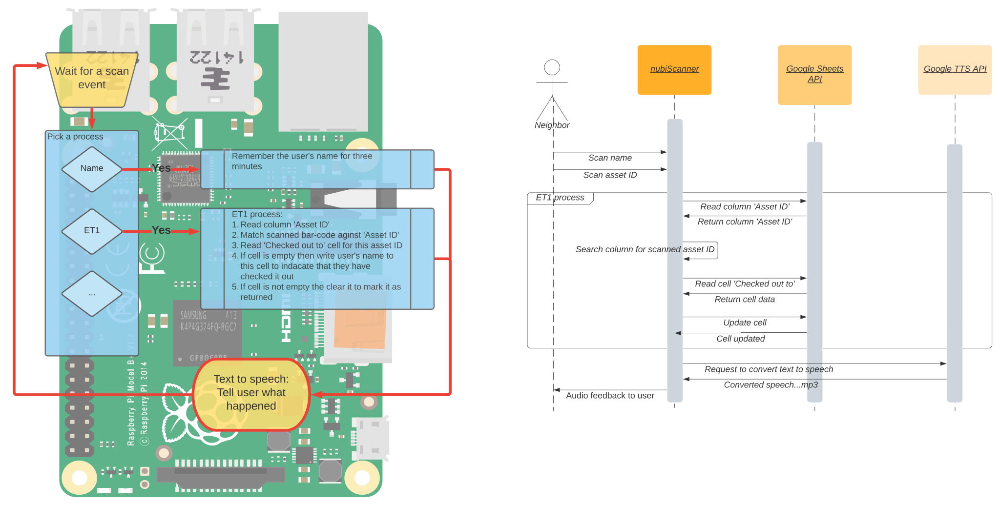

# Description
nubiScan is a general purpose bar-code scanner application. It reads in a bar-code and pulls out three pieces of information:
1. A prefix 'NUBI-': This is used to ensure that the nubi bar-codes don't get mixed up with other bar-codes.
2. A process ID: This tells nubiScan which process should handle this particular bar-code.
3. A asset ID: The exact identifier for the thing the bar-code is attached to.
Its format looks like this: 'NUBI-<processID>-<assetID>' for example 'NUBI-ET1-0000' will trigger the ET1 process on the 0000 asset.

# Process IDs
As of right now there are two process IDs.

## NAME
This is a special process ID used to track the name of the person using the bar-code scanner. It passes this information on to other process IDs. The user can then scan as many other bar-codes as they like. After each bar-code scanned the user has three minutes to scan in another bar-code before they need to scan in their name again. This allows a user to scan in as many things as they have on hand with out needing to scan their name each time. A new name can be scanned at any time. 

## ET1
The ET1 process is used for inventory control. It allows a user to check out and return equipment. The first step is for the user to scan their name off of a sheet, then the user can check out any equipment they like. Then when they wish to return it all they have to do is to scan the bar-code again. A name is not required to return equipment its only required to check it out. This process updates the Google sheet used to track all the equipment. The bar-code needs to be listed in the 'Asset ID' column. When something is checked out the 'Checked out to (Name)' column is updated with the user's name. 

## Diagrams


# Setting up a scanner station

## Hardware setup

### Linux
This software should run on any Linux box. It assumes these things:
1. Input devices are mounted in /dev/input
2. Systemd is manageing the deamons
3. Network connectivity
4. Audio out device

So long as these requirements are met you should not have a problem running nubiScan. Though it is assumed you will want to run this on a Raspberry Pi.

### The bar-code Scanner
Any bar-code scanner that enumerates as a keyboard will work so long as it can read both 1d and 2d bar-codes. There are many to choose from. Both wired and wireless scanners are available. Here is a link to the first bar-code scanner we've used: [Eyoyo Handheld USB 2D Barcode Scanner](https://www.amazon.com/gp/product/B088QV215Y/ref=ox_sc_act_title_2?smid=A1UYJA9LD7FIS5&psc=1)

## Software setup

### Raspberry Pi
Skip this section if you already have a system set up.

### Installing a Linux image
Do these steps from your Windows, Mac or Chromebook.
1. Pick and download an OS: The official Raspberry Pi OS Linux images can be found here: [Raspberry Pi operating systems](https://www.raspberrypi.org/software/operating-systems/)
Pick whichever one you like. I prefer the 'Raspberry Pi OS Lite' image because it is smaller. But you might prefer one that has desktop support, with a more traditional GUI.

2. Next you need to download an installer from here: [Raspberry Pi Imager](https://www.raspberrypi.org/software/) This allows you to write the OS image to an SD card. 
  1. Or for Chromebooks follow [These instructions](https://www.raspberrypi.org/documentation/installation/installing-images/chromeos.md)
3. Install the imager and follow it's instructions for installing the OS you downloaded in step one.

### Pre-configure your new Raspberry Pi image
Also do these steps from your Windows, Mac or Chromebook. 
Setup the network:
1. Setup wifi for nubiNet: [Setting up a Raspberry Pi headless](https://www.raspberrypi.org/documentation/configuration/wireless/headless.md)
2. Enable ssh: Follow instructions in section three 'Enable SSH on a headless Raspberry Pi' [SSH (Secure Shell)](https://www.raspberrypi.org/documentation/remote-access/ssh/README.md)

### First time boot
1. Remove the SD card from your computer and put in into the Raspberry Pi.
2. Plug the Pi into the USB-C power supply.
3. Wait a minute or so for the system to boot and configure itself.
4. ssh into the system (see section 'ssh')
5. Change the default password: ```passwd <new password>```
6. Change the hostname to nubiscanX where X is the count of installed scanners.
  1. Run this command```sudo hostnamectl set-hostname nubiscanX```
  2. Edit /etc/hosts and change the last line of the file from ```127.0.1.1     raspberrypi``` to ```127.0.1.1    nubiscanX``` with this command ```sudo nano /etc/hosts```
7. Update the system: ```sudo apt update && sudo apt full-upgrade```
8. Install pip3: ```sudo apt-get install python3-pip```
9. Install git: ```sudo apt install git```
10. Install the nubiScan software: ```git clone https://github.com/Nubanusit/nubiScan.git```
11. Setup the nubiScan software: ```~/nubiScan/setup.sh```
12. Copy the service account credentials to the ~/nubiScan directory. (also see the Service Account section)
14. Reboot: ```sudo reboot``` 
15. Plug in the bar-code scanner and you are ready to go.

### ssh
On a headless system (a system with out a monitor) it can be difficult to find the system's IP address. But there are several ways to do this.
1. Temporarily plug in a monitor and use the ```ifconfig``` command to see what the IP address is.
2. Use a network scanner to list all the devices on a network. Like this for Android: [fing](https://play.google.com/store/apps/details?id=com.overlook.android.fing&hl=en_US&gl=US)
3. Use mDNS (Multicast DNS): This is the easiest to use and my preferred method.
    * Apple's Bonjour service supports this and is naively installed. (I think...is this really true?)
    * This is supported out of the box in Win10.
    * If this is not working on your Mac or Windows box or you have a linux or Chrombook install avahi discovery or Bonjour. (Google can help you with this.)
  At this point you can always refer to your scanner with its mDNS <hostname>.local. For example: nubiscan1.local

Now that you can address the raspberry by either its IP address or its mDNS name, you can use this command to ssh into the system: ```ssh pi@<address>``` Use the default 'pi' username. 

### What is a service account
A service account is a special type of Google account that isn't for people, its for robots. Once you have a service account setup, you will have a Google identity (an email address). You can then share any Google doc with this new identity. To do that you would do it the same way you would share a document with a person. Find the 'share' settings and add the service accounts email address. 

[More than you will ever need to know about Google service accounts](https://cloud.google.com/docs/authentication/production)

#### Adding an existing service account
I've already created a service account for this purpose, nubiBot2000. But there is nothing special about it. You can also create a new one. It's safe to use several accounts so long as you are also sharing the appropriate Google docs with it. But because its quite tedious to create one and because there is no advantage of using several accounts, I can give you a copy of nubiBot2000's credentials file. The credentials work as the password to the service account it should be protected and handled with care. This is why it's not checked in to this repo. This is also why its important to change the default password. 

#### Setting up a new service account
See [More than you will ever need to know about Google service accounts](https://cloud.google.com/docs/authentication/production)

### Maintenance
##### Systemd and starting nubiScan.py on boot
The setup.sh script sets this up for you with these two commands:
```
sudo systemctl enable nubiScan
sudo systemctl start nubiScan
```
The first command tells it to automaticaly start on boot. The second one starts it right now.
You can check the status of a running process with this command:
```
sudo systemctl status nubiScan
```
You can stop it like this:
```
sudo systemctl stop nubiScan
```

#### Editing files on the Raspberry pi
The Raspberry pi's preinstalled file editor is called ```nano```. Use this if you ever need to edit files.

#### Updating the nubiScan's software
Once a system is setup its easy to update to newer versions. It can be done with two easy steps:
1. From the nubiScan directory run ```git pull```
2. Restart the systemd service: ```sudo systemctl restart nubiScan.service```


# Techncal references
* [More than you will ever need to know about Google service accounts](https://cloud.google.com/docs/authentication/production)
* [Google Sheets API](https://developers.google.com/sheets/api/reference/rest)
* [Python wrapper for Google's TTS service](https://gtts.readthedocs.io/en/latest/module.html#module-gtts.tts)

